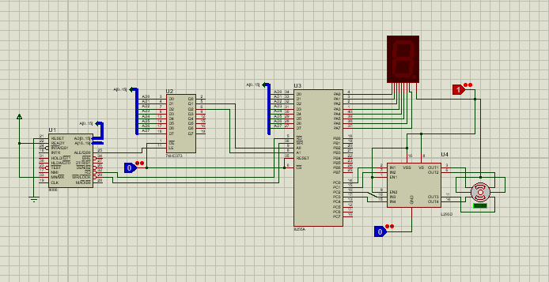
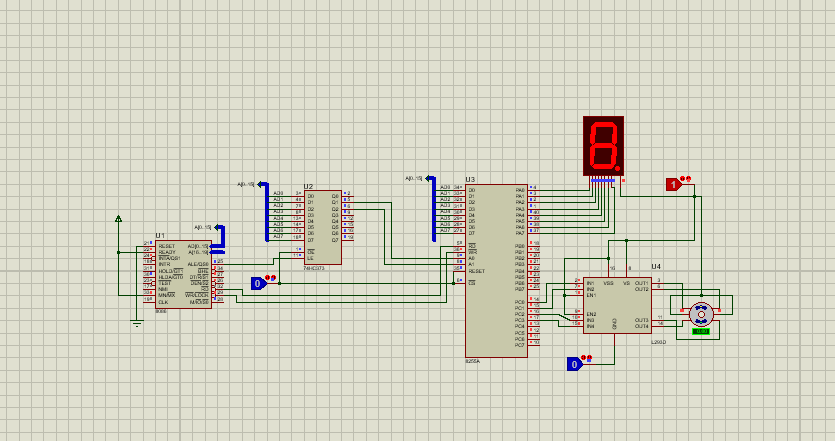

# 8086 Mikroişlemci ile 7 Segment Gösterge ve Adım Motoru Kontrolü

Bu proje, 8086 mikroişlemci kullanarak bir 7 segment gösterge ve adım motorunun nasıl kontrol edileceğini göstermektedir. Proteus simülasyon programı kullanılarak gerçekleştirilen bu proje, mikroişlemci tabanlı sistemlerde temel giriş/çıkış (I/O) kontrollerinin nasıl yapılacağını öğretmeyi amaçlamaktadır.

## Proje Bileşenleri

- **8086 Mikroişlemci (U1):**
  - Merkezi işlem birimi olarak görev yapar.
  - Adres ve veri hatları aracılığıyla diğer bileşenlerle iletişim kurar.

- **74HC373 Latch (U2):**
  - Adres hatlarını geçici olarak tutmak için kullanılır.
  - Adresleme işlemlerinde 8086 mikroişlemcinin ALE sinyali ile kontrol edilir.

- **8255A Programlanabilir Periferik Arayüz (U3):**
  - Giriş/çıkış portlarını kontrol etmek için kullanılır.
  - 7 segment gösterge ve adım motoruna veri gönderir.

- **7 Segment Gösterge:**
  - Sayısal bilgileri göstermek için kullanılır.
  - 8255A tarafından kontrol edilir.

- **L293D Motor Sürücü (U4):**
  - Adım motorunu sürmek için kullanılır.
  - 8255A tarafından kontrol edilir.

- **Adım Motoru:**
  - L293D motor sürücü tarafından kontrol edilir.
  - 8255A aracılığıyla mikroişlemci tarafından sürülür.

## Devre Bağlantıları

- **8086 Mikroişlemci (U1):**
  - Adres hatları (A0-A15) 74HC373 latch'e bağlanır.
  - Veri hatları (D0-D7) doğrudan 8255A PPI'ye bağlanır.
  - Kontrol sinyalleri (ALE, RD, WR) uygun pinlere bağlanır.

- **74HC373 Latch (U2):**
  - Adres hatları (A0-A7) 8255A'ya bağlanır.
  - LE (Latch Enable) sinyali, 8086'nın ALE sinyaline bağlanır.

- **8255A PPI (U3):**
  - Port A (PA0-PA7) ve Port C (PC0-PC7) 7 segment göstergeye bağlanır.
  - Port B (PB0-PB7) L293D motor sürücüye bağlanır.
  - Kontrol sinyalleri, 8086 mikroişlemciye bağlanır.

- **L293D Motor Sürücü (U4):**
  - IN1-IN4 girişleri 8255A'nın Port B çıkışlarına bağlanır.
  - OUT1-OUT4 çıkışları adım motoruna bağlanır.
  - Enable sinyalleri (EN1, EN2) doğru şekilde bağlanır.
  - 
  - simülasyon çalıştırınca ilgili görsel ektedir
  - sayılar artıp tekrar başa dönüyor
  - 
